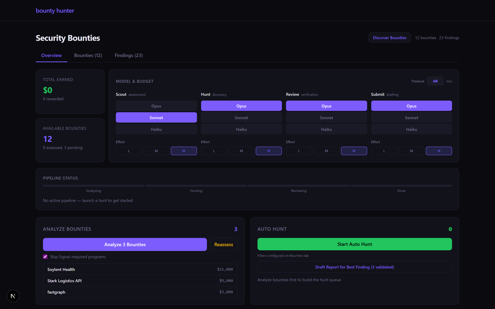
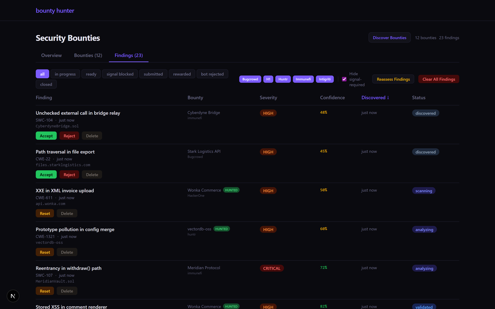

# autohack

**An autonomous security researcher that hunts real bug-bounty programs end to end.**

autohack discovers bounty programs across five platforms, spawns hour-long Claude
sessions to hunt for vulnerabilities, validates its own findings through
adversarial self-review, drafts platform-ready reports, and submits them — with a
human approval gate in front of anything that goes out. It learns across hunts:
every outcome, near-miss, and triager response is written to a memory store so the
next session starts with context from every past one.





<sub>The real-time tRPC dashboard. Top: the tiered-model control (Scout / Hunt /
Review / Submit, each assignable to Opus, Sonnet, or Haiku) and the live pipeline.
Bottom: findings moving through the lifecycle with per-finding confidence and
status. <b>Shown with sample data.</b></sub>

Built with direct Anthropic SDK calls — no LangChain, no CrewAI, no framework
wrappers.

## How it works

1. **Discovery** — polls five bounty platforms (HackerOne, Immunefi, Huntr, plus
   an aggregator covering Bugcrowd, Intigriti, and YesWeHack), deduplicates
   targets, and ranks them by payout, scope, freshness, and saturation.
2. **Analysis** — pulls each target's scope, prior reports, and asset inventory,
   then produces a hunt strategy and feasibility score.
3. **Hunt** — spawns Claude in a pseudo-terminal for a 60-minute session with a
   scoped cheat sheet. It works autonomously on recon, exploit discovery, and
   validation, streaming every tool call to the dashboard in real time.
4. **Adversarial self-review** — a *second* Claude instance attacks the finding
   from the opposite direction, scores it on a 0–15 binary rubric, and tries to
   disprove it. Anything below the threshold is rejected before it becomes a draft.
5. **Report drafting** — generates a platform-formatted report with reproduction
   steps, impact analysis, and remediation. A separate Sonnet pass compresses
   verbose findings before submission.
6. **Submission** — optionally auto-submits through the platform API, gated behind
   a manual approval flag.

Findings move through a **12-state lifecycle**, visible on the board above:

```
discovered → scanning → analyzing → validated → drafting → reviewing
   → submitted → triaged → accepted / rewarded / duplicate / rejected
```

## Highlights

- **Adversarial validation gate.** A finding only advances from `scanning` to
  `drafting` after a separate Claude instance tries to refute it and scores it
  ≥ 8/15. This filters hallucinated findings before they ever reach a report.
- **Tiered models per stage.** Scout, Hunt, Review, and Submit are each assignable
  to Opus, Sonnet, or Haiku with independent effort levels — spend Opus where it
  matters, Haiku where it doesn't. Configurable live from the dashboard.
- **Cross-hunt memory.** Every hunt writes findings, near-misses, and dead ends to
  a persistent store; new hunts are primed with relevant prior context so the model
  doesn't re-explore known dead ends.
- **PTY-based Claude spawning.** Hunts run in a pseudo-terminal so output streams
  live to the dashboard via xterm.js, with a hard 60-minute timeout and graceful
  shutdown.
- **Ephemeral prompt caching** cuts input tokens ~90% across repeated hunt
  sessions. **Dual backends:** Claude Max via the CLI, or the API via SDK
  (`CLAUDE_BACKEND=cli|api`).
- **Crash-safe coordination.** A cross-process lock file plus stale-PID detection
  stops two hunts from touching the same target; error classification (transient /
  permanent / validation / timeout) decides whether to retry, skip, or kill.

The same harness also runs a bounty agent on the Algora platform: it spawns Claude
Code sessions for long autonomous runs, executes the test suite, opens PRs, and
addresses review feedback on its own.

## Architecture

```
packages/
  core/                 shared config, DB (SQLite + Drizzle), logging, Claude wrappers
  security-discovery/   HackerOne, Immunefi, Huntr, Bugcrowd, Intigriti pollers
  security-analyzer/    target ranking and feasibility
  security-solver/      PTY-based Claude spawning, 60-min hunt sessions
  security-memory/      cross-hunt outcome and near-miss learning
  dashboard/            Next.js 15 + tRPC real-time monitoring UI
orchestrator.ts         cron-scheduled hunt loop
```

## Stack

TypeScript · Node.js · Next.js 15 · tRPC · SQLite + Drizzle ORM · Anthropic SDK ·
xterm.js · Pino · node-cron · pnpm monorepo.

## Running locally

```bash
pnpm install
cp .env.example .env    # set HACKERONE_API_TOKEN, IMMUNEFI_API_KEY, etc.
pnpm dev                # orchestrator + dashboard on :3456
pnpm dashboard          # dashboard only (no hunts), on :3456
```

## Scope and ethics

autohack only hunts targets with active, in-scope bug-bounty programs, and never
attacks systems without authorization. The cheat sheet and prompt scaffolding
explicitly bound Claude to each program's declared scope. Every submission passes
through a manual approval gate unless auto-submit is explicitly enabled.
